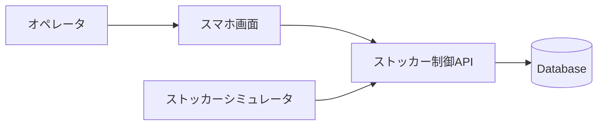
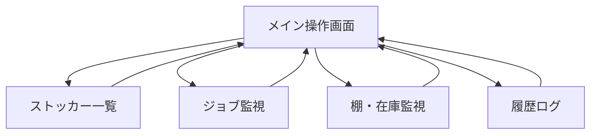
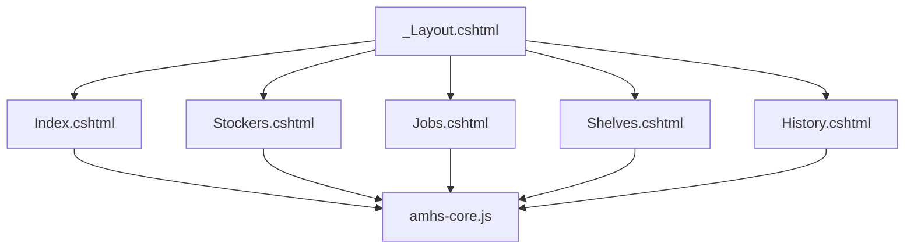
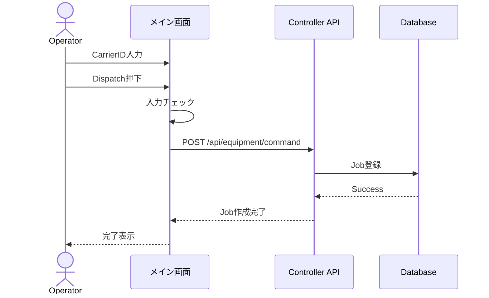
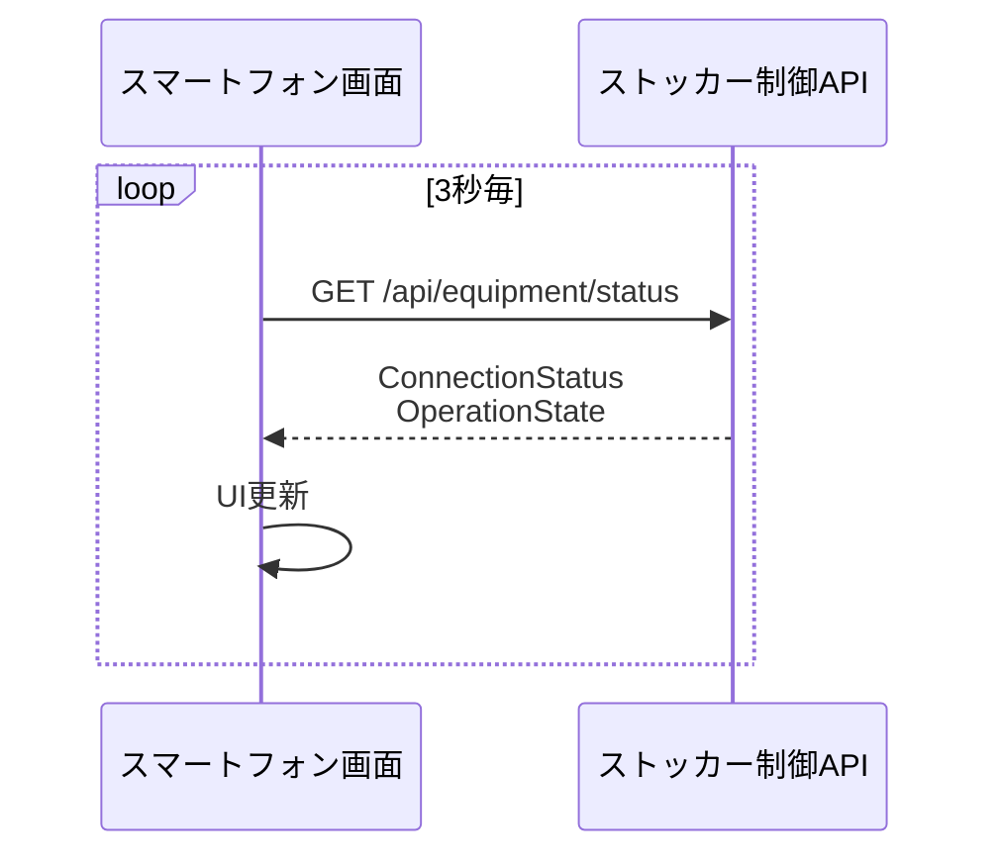
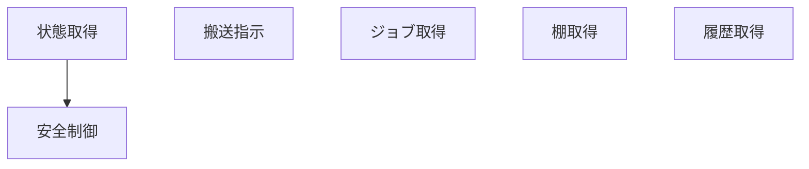
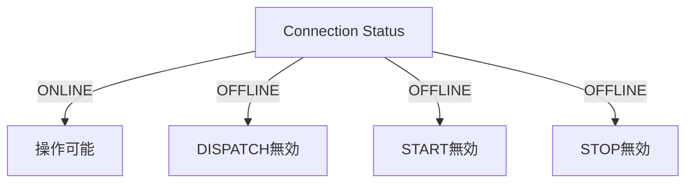
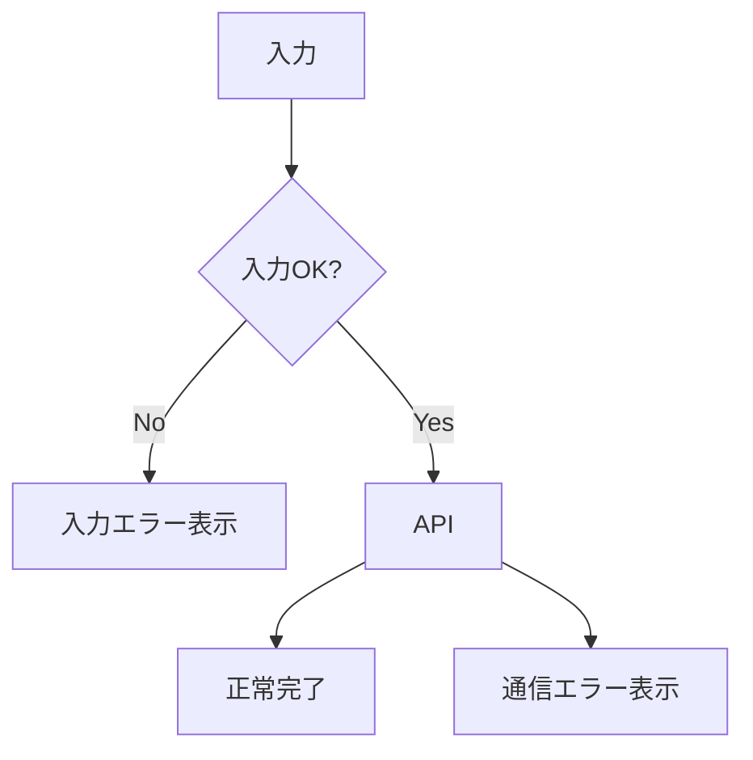

# フロントエンド担当内容

## 担当概要

本プロジェクトにおいて、私はスマートフォン向けオペレータ端末のフロントエンド開発を担当した。

主な担当範囲は以下の通りである。

* Razor Pagesによる画面作成
* Bootstrapを利用したスマートフォンUI設計
* JavaScriptによる画面制御
* REST API連携
* 3秒周期ポーリング処理
* エラーハンドリング
* PWA対応

---

# システム利用イメージ

オペレータはスマートフォンから搬送指示を実行する。

システムはストッカー状態を監視しながら、ジョブの登録・実行・完了を管理する。



---

# 画面遷移



---

# フロントエンド構成

共通レイアウトを利用し、全画面で同じヘッダーとナビゲーションを利用する。



---

# 搬送指示処理

オペレータが搬送指示を実行した際の流れ



---

# 状態監視ポーリング

画面更新を行わなくても、装置状態を自動監視する。



JavaScriptでは以下のように実装している。

```javascript
setInterval(
  refreshStatus,
  3000
);
```

---

# JavaScriptの役割

画面表示だけではなく、業務ロジックも担当している。



主な関数

* refreshStatus()
* dispatchJob()
* loadJobs()
* loadStockers()
* loadShelves()
* loadHistory()
* updateSafetyInterlock()

---

# 安全インターロック

ストッカーがOFFLINE状態の場合、誤操作防止のため操作を禁止する。



---

# エラーハンドリング

フロントエンドでは入力エラーと通信エラーを処理する。



---

# 実装成果

* スマートフォン向け5画面実装
* 共通レイアウト作成
* REST API連携
* JavaScript共通モジュール化
* 3秒ポーリング監視
* 安全インターロック実装
* エラーハンドリング実装
* PWA対応

---

# 学習できたこと

* Razor Pages設計
* JavaScript非同期通信(Fetch API)
* REST API連携
* ポーリング方式によるリアルタイム監視
* フロントエンドアーキテクチャ設計
* 半導体AMHSシステムの基本構造

```
```
