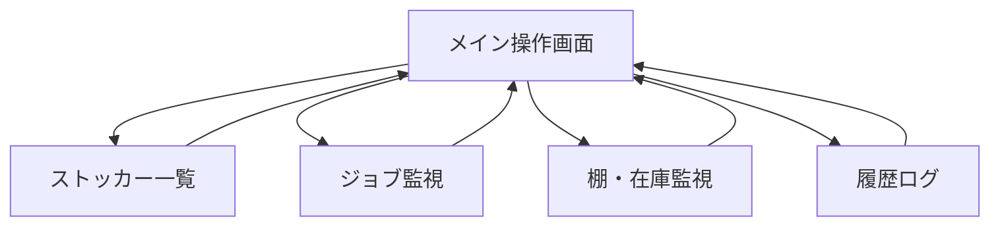
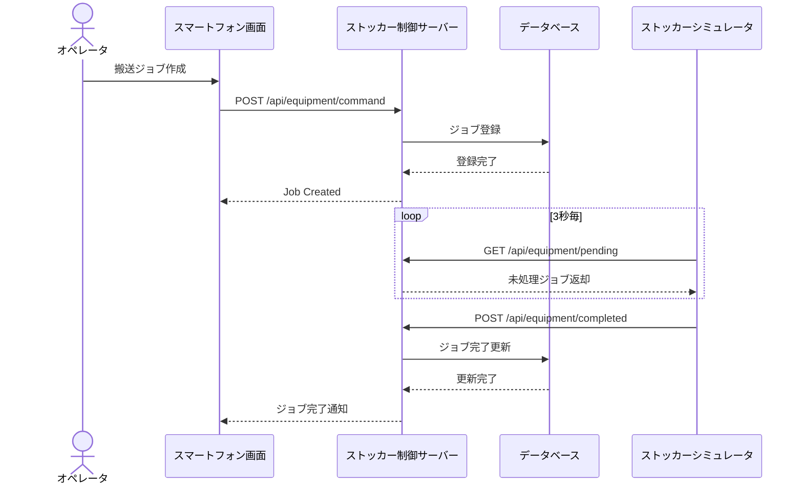
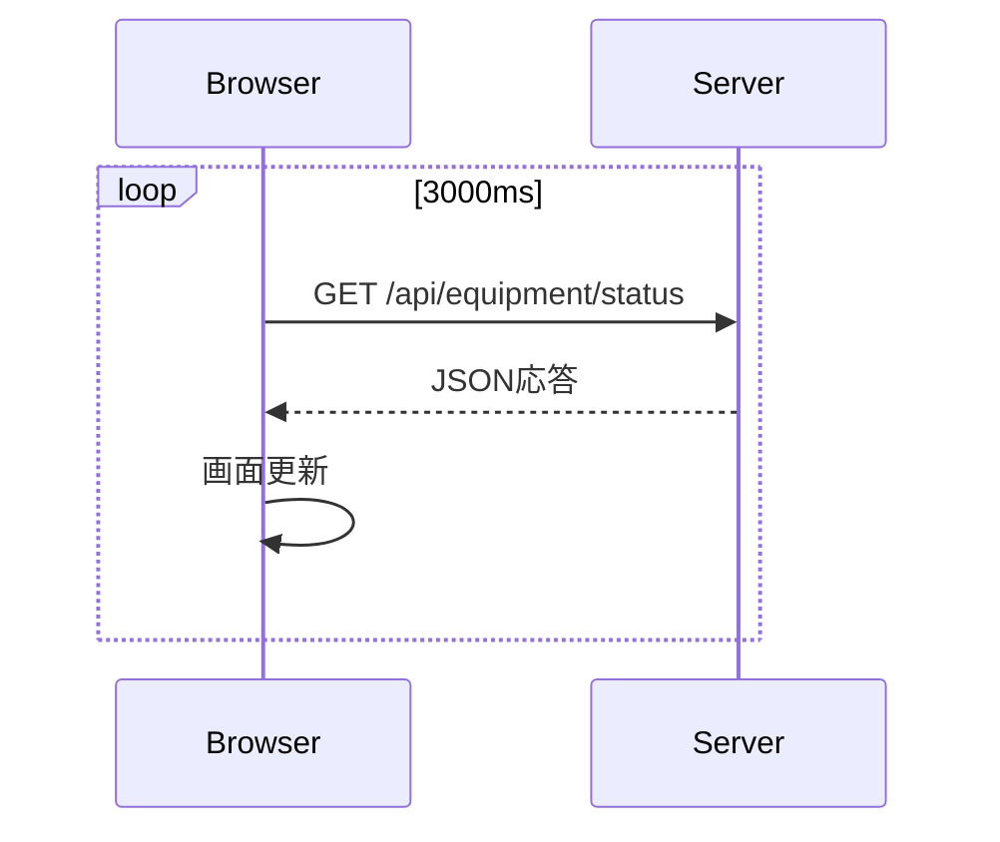
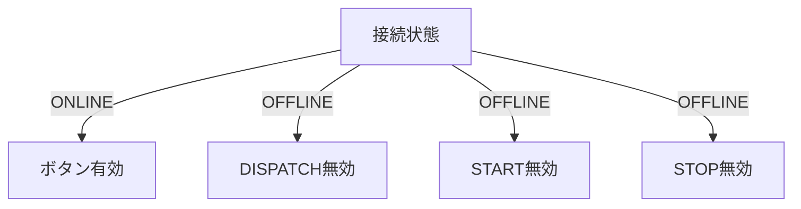
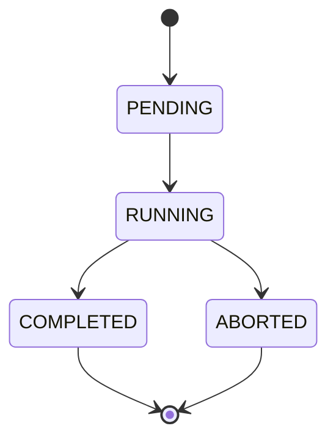

# AMHSストッカー監視制御システム

## 概要

本システムは、半導体工場向けAMHS（Automated Material Handling System）を模擬したストッカー監視制御システムです。

スマートフォン向けの操作端末から搬送指示を行い、ストッカー状態監視、ジョブ監視、棚在庫監視、および履歴管理を実現します。

本システムは ASP.NET Core Razor Pages を利用して開発しており、PWA（Progressive Web App）としてスマートフォンから利用可能です。

---

# システム構成

```text
+------------------------------------------+
|      スマートフォン操作端末(PWA)         |
|      ASP.NET Core Razor Pages            |
+-------------------+----------------------+
                    |
                    | REST API
                    v
+------------------------------------------+
|       ストッカー制御サーバー             |
|       ASP.NET Core Web API               |
+-------------------+----------------------+
                    |
                    |
                    v
+------------------------------------------+
|            SQL Server DB                 |
+------------------------------------------+

                    ^
                    |
                    |
             3秒周期ポーリング

+------------------------------------------+
|      ストッカーシミュレータ(Console)     |
+------------------------------------------+
```

---

# 使用技術

| 分類       | 技術           |
| -------- | ------------ |
| バックエンド   | ASP.NET Core |
| フロントエンド  | Razor Pages  |
| UI       | Bootstrap 5  |
| クライアント処理 | JavaScript   |
| DB       | SQL Server   |
| 通信方式     | REST API     |
| モバイル対応   | PWA          |
| 設計図      | Mermaid      |

---

# 機能一覧

| 機能ID  | 機能名       |
| ----- | --------- |
| F-001 | 装置状態監視    |
| F-002 | 搬送指示      |
| F-003 | アラーム通知    |
| F-004 | ジョブ監視     |
| F-005 | 棚在庫監視     |
| F-006 | 履歴ログ監視    |
| F-007 | 安全インターロック |
| F-008 | メイン操作画面   |
| F-009 | ストッカー一覧   |

---

# 画面構成



---

# システム処理フロー



---

# 状態監視ポーリング

装置状態は3秒間隔で取得する。



---

# 安全インターロック

ストッカーがOFFLINE状態の場合、搬送指示を禁止する。



---

# ジョブ状態遷移



---

# 棚在庫管理

棚状態は Occupied フラグによって管理する。

| Occupied | 状態     |
| -------- | ------ |
| true     | キャリアあり |
| false    | 空棚     |

---

# API一覧

## 装置関連

```http
GET  /api/equipment/status
POST /api/equipment/command
GET  /api/equipment/pending
POST /api/equipment/completed
```

## ストッカー関連

```http
GET /api/stockers
```

## ジョブ関連

```http
GET    /api/jobs/active
DELETE /api/jobs/{id}
```

## 棚関連

```http
GET /api/inventory/shelves
```

## 履歴関連

```http
GET /api/logs/recent
```

---

# プロジェクト構成

```text
Pages
│
├─ Index.cshtml
├─ Stockers.cshtml
├─ Jobs.cshtml
├─ Shelves.cshtml
├─ History.cshtml
│
├─ Shared
│   └─ _Layout.cshtml
│
wwwroot
│
├─ js
│   └─ amhs-core.js
    └─ amhs-core.js
    └─ amhs-core.js
    └─ amhs-core.js
    └─ amhs-core.js
    └─ amhs-core.js
    └─ amhs-core.js
│
├─ manifest.json
│
└─ sw.js
```

---

# 担当範囲

## フロントエンド

* Razor Pages
* Bootstrap UI
* スマートフォン画面設計
* JavaScript制御
* API連携
* エラーハンドリング
* PWA対応


---


```
```

